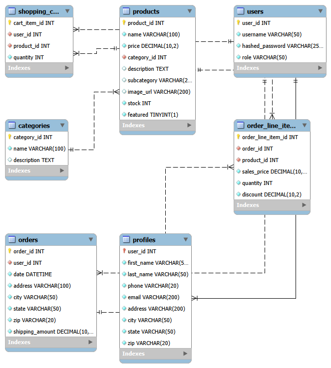

# E-commerce API (Capstone Project, Week 12)

This is an E-commerce themed Web API.

It connects to a MySQL database and provides standard CRUD methods
for interacting with it, with JWT based authentication and authorization.


```java
    @DeleteMapping
    @PreAuthorize("hasRole('ROLE_USER')")
    ResponseEntity<ShoppingCart> deleteCart(Principal principal) {
        User user = userService.getLoggedInUser(principal);
        shoppingCartService.deleteCart(user.getId());
        return ResponseEntity.ok(shoppingCartService.getByUserId(user.getId()));
    }
```

I found this snippet interesting. Not for what it does, really, but why it does it.
While an action like "delete the whole contents of the cart" does not really need a response
body in the success case, the Web frontend expects there to be one.

Specifically, the Web frontend expects us to return the up-to-date state of the cart
in our response to the `DELETE` request, so it can immediately turn around and re-render the page using it.

## The Database

Pictured below is an ERD for the database used in this project.


